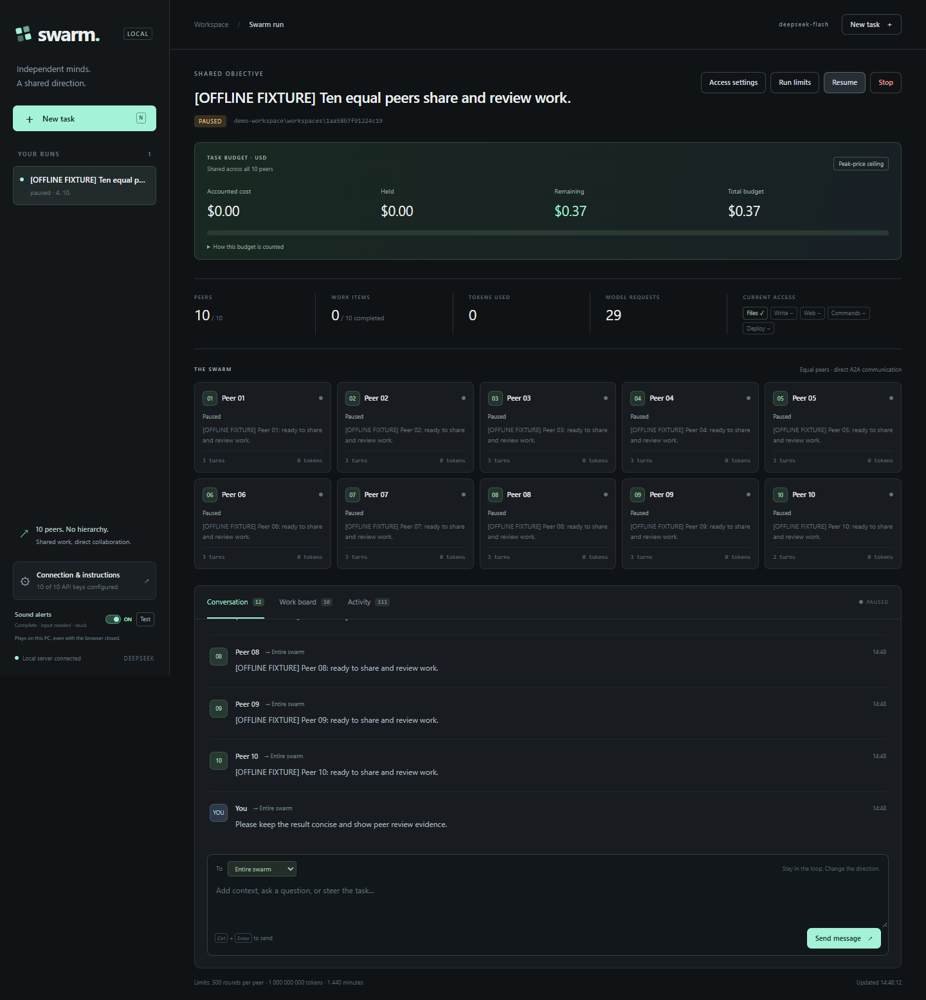

# DeepSeek Peer Swarm

A local, Windows-first harness for **ten equal DeepSeek agents**, each using its own API key. Give the swarm a task in your browser, follow its work, send new instructions while it runs, and decide which tools it can use. No agent is assigned a boss, architect, or permanent specialist role.

The project explores peer coordination with a shared work board, independent review, durable recovery, and per-task spending controls. Its Python backend uses FastAPI and SQLite; the browser interface is vanilla JavaScript with no frontend build step.

**Free and open source under the [MIT license](LICENSE).** Use, modify, and share the code, including commercially, while keeping the license notice. Live DeepSeek API usage is billed separately by the provider; the offline demo and automated tests need no paid credentials.



Screenshots use an **offline fixture** with synthetic keys, peer messages and request counts; no paid model calls were made. Workspace paths are replaced with `demo-workspace`. See the [mobile dashboard](docs/images/mobile.png) and [mobile settings](docs/images/mobile-settings.png); the configured key slots in the settings image contain test placeholders only.

## Quick start

Install Python 3.11 or newer. From the project directory:

```powershell
python -m venv .venv
.\.venv\Scripts\python.exe -m pip install -r requirements.lock
.\.venv\Scripts\python.exe -m pip install --no-deps -e .
.\.venv\Scripts\python.exe -m swarm --open
```

1. The dashboard opens at **http://127.0.0.1:8767**. On later starts, double-click **Start-Swarm.cmd**.
2. Open **Settings** and enter ten different DeepSeek API keys in the ten password fields. Blank fields preserve saved keys. Save. Do not paste keys into task chat.
3. Create a task. Choose an existing workspace, or leave the workspace blank to get a new isolated folder. Set the **Task budget (USD)** for all ten peers combined, plus permissions and run limits.
4. Send follow-up instructions to the whole swarm or a particular peer. Use **Pause**, **Resume**, or **Stop** at any time. Permission changes briefly pause workers and cancel current commands before resuming.

**Stop-Swarm.cmd** pauses active work and closes the server. Starting the server again restores saved runs in a paused state. Select a run and Resume to continue. Windows must remain awake and connected for work to progress; there is no reboot autostart or remote hosting.

Bring your own DeepSeek API keys; none are included. Opening the dashboard makes no paid model calls. Starting a live task sends requests to DeepSeek and incurs provider charges.

## How the swarm works

- Ten asynchronous workers have identical tools and authority; each always uses its own numbered key. The deterministic host handles persistence, scheduling, access checks and budgets, not planning.
- Agents negotiate directly through A2A messages and a shared board. Any peer can suggest work, atomically claim an available item, publish results, and review another peer's work. Specialization emerges from the task, with no fixed pipeline or role assignment.
- A completed item needs a different peer's review. The run completes after all board items are reviewed and all ten peers vote for the same current task revision. New instructions or board changes invalidate old votes. Agreement is a coordination rule, not a guarantee that an AI result is correct.
- User input is delivered on the next model turn after the current request/tool batch. It does not interrupt an HTTP request mid-response. Pause cancels in-flight requests and commands immediately, subject to process cleanup.
- Checkpoints, messages, work claims, approvals, events, token accounting and tool-call histories are stored in SQLite. Context is trimmed only between complete tool-call turns, retaining recent turns, current board state and durable peer summaries.
- On failure, another peer can claim released work. Transient provider failures retry with backoff up to five consecutive failures per peer. Fatal key/model errors pause that peer and are shown in activity.
- After interruption, unfinished tool calls are recorded as having an uncertain outcome. The harness does not blindly replay a deployment or command. Peers must inspect its actual result before trying again.

The editable base prompt is in [swarm/prompts/peer.md](swarm/prompts/peer.md), and is also available in Settings. Prompt/model settings apply to **new runs**; existing runs retain their saved configuration. Updating saved keys applies to subsequent requests when a run is resumed. The per-request output cap defaults to 8,192 tokens including thinking; set its default in Settings or change it for an existing task in Run limits. Truncated model responses pause the affected peer rather than executing incomplete tool calls.

## Access controls

| Control | Behavior |
| --- | --- |
| Read files | Read/list files within the selected workspace. Secret files, internal backups and the harness state directory are blocked. |
| Write files | Create, edit and replace workspace files. Existing files require a matching SHA-256 revision. Original versions are backed up in `.swarm-backups`. |
| Internet | Search and fetch public HTTP(S) pages. Local/private network targets are blocked. DeepSeek API access is separate and required for live reasoning. |
| Commands | Deny, ask for the exact command, or allow for the run. Supports tests, builds and experiments. |
| Deployment | The same three choices for the dedicated deployment command tool. |

**Commands execute as your Windows user, not inside an operating-system sandbox.** A shell can access files, network, credentials and deployment tools beyond the built-in file/internet switches. The separate deployment permission relies on the agent selecting the correct tool; arbitrary command permission is broad enough to perform deployment too. Keep Commands on **Ask** when you want to review exact actions. For untrusted autonomous code, run the entire harness in a separate VM/account/container.

Commands use PowerShell without a profile, have an explicit timeout (up to 24 hours), bounded output, and process-tree cleanup. They cannot leave detached background children running after the invocation. Pausing or stopping kills active experiment processes; external deployments may already have taken effect and are not automatically rolled back. The harness does not provide hosting accounts or deployment credentials; it uses tools installed and configured in your chosen environment.

## Long runs and limits

Defaults are **$1.00 per task**, 500 model requests **per peer**, 1,000,000,000 total tokens across the swarm, and 1,440 active minutes. The token limit is deliberately set high so the dollar budget is the binding control; lower it only if you want a separate token ceiling. Limits can be edited for an existing task; already used money, tokens and time are retained. Raise the limits and Resume after a budget pause. A budget cannot be lowered below money already spent or held.

Every API attempt, including retries, reserves an **expected** cost **before** it is sent, estimated from this run's own settled calls: how much of the byte-derived bound became real prompt tokens, what those tokens cost at the observed cache mix, and how long replies actually ran. Until the first call is priced, the cheapest rate the account could pay is assumed. The estimate is a throughput forecast, not a ceiling. The shared check and durable reservation are atomic across all ten workers. Peers wait when funds are temporarily reserved by active calls. Once no active call can release funds and another bounded request cannot fit, the swarm pauses and sounds an alert. It can pause before the displayed spend reaches the full cap because the next request needs enough headroom.

The cost formula is `(cached input tokens × cached rate + uncached input tokens × uncached rate + completion tokens × output rate) / 1,000,000`. Counts come from DeepSeek's response, including cache hits/misses; thinking is already included in completion tokens and is not charged twice. Missing cache detail uses the full input rate. Invalid or missing usage, canceled requests, network failures, and crashes are charged at the run's learned rate as an **uncertain hold**, not a free request. Money is calculated in integer billionths of a US dollar without floating-point accumulation. The database commits each request's ledger record and run balances together.

Each call is priced at the rate in force when it was made. DeepSeek charges **half** these rates outside its peak windows (**01:00-04:00 and 06:00-10:00 UTC, Monday to Friday**). Official peak rates checked **September 23, 2026**, per million tokens:

| Model | Cached input | Uncached input | Output including thinking |
| --- | ---: | ---: | ---: |
| `deepseek-flash` | $0.006 | $0.30 | $1.20 |
| `deepseek-v4-pro` | $0.044 | $1.32 | $3.96 |

Chinese public holidays are also off-peak but are not published as machine-readable data, so calls on those days are billed here at the peak rate, overstating rather than understating cost. Each run and each API call retain the price snapshot used, including the peak and off-peak rates; a snapshot written before off-peak support keeps billing at peak so old ledgers never change value. Only officially priced model names are accepted. Prices may change, and the local guard cannot enforce a provider-side billing cap or cover spending by other applications. Because forecasts can land under the real cost, the dollar cap is enforced on settled spend: once measured plus uncertain cost reaches the budget the run pauses, so actual spend can overshoot by at most the calls already in flight. Update the pricing table when the provider changes rates. [Official prices](https://api-docs.deepseek.com/quick_start/pricing/) · [Usage fields](https://api-docs.deepseek.com/api/create-chat-completion/).

The dashboard shows **Accounted cost**, **Held**, **Remaining**, and **Total budget**. `/api/runs/{id}/costs` shows recent request records; `/api/runs/{id}/export` includes the complete cost ledger. A pre-upgrade paid run without a complete cost ledger cannot resume under an invented zero balance; start a new task with a new explicit allowance. This budget covers DeepSeek calls made through the harness, not deployment hosting, compute, or other external-service charges.

Turn and active-time limits survive restart; an abrupt crash can lose up to 15 seconds of the active-time counter. Long histories are compacted and hot message state is bounded; the complete public event log remains in the database. There is no automatic cleanup of event history or file backups. Ten keys do not guarantee ten independent provider quotas; account-level limits may still apply.

## Sound alerts and stalled work

**Sound alerts** in the sidebar are on by default. **Test** plays a short preview; the switch saves your preference. Distinct Windows sounds announce task completion, an input/approval request, and blocked work or a budget stop. Alerts are played by the local server, so they also work with the browser closed. Windows/audio-device volume and mute settings still apply. They do not change your Windows sound settings.

Duplicate notifications from several peers are coalesced with a 15-second cooldown. Existing events are not replayed on startup. A silent or unavailable audio device is reported in the sidebar; visual attention messages remain in the dashboard.

The default **stall limit is 10 active minutes** without a new successful work/tool result. Repeated identical actions and peer chatter do not reset it. A possible stall pauses work and alerts you; you can provide direction, inspect results, increase the limit, and Resume. Current command/deployment processes and pending approvals are exempt from this heuristic: commands have their own explicit timeout, and approvals already trigger an input alert. Set the stall limit when creating a task or in Run limits. This is a practical no-progress detector, not proof that an arbitrary task is stuck.

## Private local state

Runtime data is kept outside the source tree by default:

```text
%LOCALAPPDATA%\DeepSeekPeerSwarm\
  keys.enc           Windows DPAPI encrypted, bound to your Windows account
  access-token.txt   Local dashboard/A2A access token (not a DeepSeek key)
  settings.json      Model and editable base prompt
  notifications.json Saved sound-alert preference
  swarm.sqlite      Runs, event log, checkpoints and atomic API cost ledger
  workspaces\       Default per-run workspaces
  server.*.log       Server startup/error logs
```

Saved API keys are not placed in browser storage. Configured keys and the local access token are redacted from public task state, messages, events, settings, and exports. Private model histories and task data are stored locally in SQLite without encryption; filesystem/account permissions protect them. Redaction recognizes configured credentials, not every possible secret or personal detail. Do not embed unrelated secrets in task prompts or tool arguments, and review exports and screenshots before sharing. The server binds to loopback only, blocks cross-origin requests and checks an access token for mutations. It is a single-user local service, not a multi-user security boundary.

For an isolated instance, use `python -m swarm --data-dir C:\path\to\private-state --port 8768`. On non-Windows systems, supply `DEEPSEEK_API_KEY_1` through `DEEPSEEK_API_KEY_10` via environment variables; persistent key saving intentionally requires Windows DPAPI.

## A2A

Implemented against the current **A2A 1.0 JSON-RPC binding**:

- Collective discovery: `/.well-known/agent-card.json`
- Peer discovery: `/a2a/agents/peer-01/.well-known/agent-card.json` through `peer-10`
- Collective endpoint: `/a2a`
- Peer endpoints: `/a2a/agents/peer-01` through `peer-10`
- Methods: `SendMessage`, `GetTask`, `ListTasks`, `CancelTask`

Peer messages pass through the same validated A2A dispatcher in-process; external local clients use HTTP. The local transport avoids ten extra listening processes. HTTP requests need `A2A-Version: 1.0` and the local access token. Create tasks and grant permissions through the dashboard first; A2A messages target existing task/context IDs and cannot grant permissions. Text messages and polling are supported; streaming, push notifications, file parts, and outside-agent discovery are not implemented or advertised.

See [docs/A2A.md](docs/A2A.md) for a request example.

## Development and verification

Python 3.11 or newer is required. Dependencies are pinned in `requirements.lock` for repeatable installation. Tests use temporary state and simulated providers; they do not need API keys.

```powershell
.\.venv\Scripts\python.exe -m pytest -q
.\.venv\Scripts\python.exe scripts\check_publication.py
.\.venv\Scripts\python.exe -m pip check
```

Main modules: `engine.py` runs peer workers, `store.py` persists state, `provider.py` calls DeepSeek, `toolbox.py` applies tool permissions, `a2a.py` exposes the protocol, and `app.py` serves the API and static browser interface.

Tests cover the A2A contract, permission checks, path traversal, revision conflicts, approvals, process cancellation, secret redaction, concurrent lifecycle actions, recovery, accounting, and messages arriving during model calls. Peer claims, review, and unanimous completion are exercised against simulated providers without API keys. These are local checks; real DeepSeek behavior must be verified after you add your keys.

See [verification](docs/VERIFICATION.md) for the latest results and the offline browser smoke test. The GitHub Actions workflow runs the automated suite and publication check on Windows.

The optional browser check requires Playwright and an installed Chrome browser. It starts and removes its own temporary app state, exercises task controls and screenshots, and never connects to an existing swarm or real provider:

```powershell
.\.venv\Scripts\python.exe -m pip install playwright
.\.venv\Scripts\python.exe scripts\browser_smoke.py --demo
```

Use `--browser` to provide another Chrome/Chromium executable path and `--screenshots` to choose an output directory. By default images go to the ignored `.browser-check` directory. The old `--live-run` option has been removed.

## Preparing a public repository

Keep runtime databases, key vaults, access tokens, workspaces, contact exports, command output, and file backups outside the repository. The ignore rules cover common runtime artifacts; already-tracked files still need to be removed from Git explicitly.

Run `python scripts/check_publication.py` before publishing. It checks tracked and non-ignored files for common secret formats, personal home paths, email addresses, and private artifacts, reporting locations without printing values. Before Git initialization it scans the source tree. This heuristic does not inspect Git history or establish that screenshots are safe. Review images visually and generate portfolio screenshots from synthetic data.

The publication check also rejects unexpected top-level folders. If the source layout changes, review the new directory and update `SOURCE_DIRS` in the checker explicitly before packaging it.

Build a checked source archive with `python scripts/package_release.py`. It includes the source, tests, screenshots, documentation, license and GitHub workflow, and excludes local environments, caches and runtime data. See [upload instructions](docs/GITHUB_UPLOAD.md) and [contribution guidelines](CONTRIBUTING.md).

## License

This project's code and original documentation are released under the [MIT license](LICENSE). Third-party dependencies retain their own licenses and are installed separately. This is an independent project, not an official DeepSeek product.

Reference interfaces checked September 22, 2026: [DeepSeek models](https://api-docs.deepseek.com/quick_start/pricing/), [thinking and tool calls](https://api-docs.deepseek.com/guides/thinking_mode/), and the [A2A specification](https://a2a-protocol.org/latest/specification/). The default model is `deepseek-flash`; thinking is enabled and provider `reasoning_content` is preserved privately across tool-call turns.
